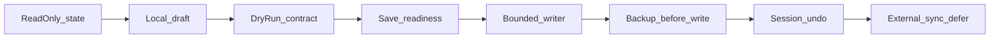

# Studio Save Pattern Playbook

Hub: [`background-builder.md`](background-builder.md) · [`studio-preview.md`](studio-preview.md) · [`../../docs/UI_REDESIGN_PLAN.md`](../../docs/UI_REDESIGN_PLAN.md)

**Checkpoint:** v1.35.0 · reference implementation: `stronaglowna` background (F5.4a → F5.4b2) · **Background Builder local v1 complete**

Ten dokument jest **standardem pracy** dla przyszłych komponentów Studio z lokalnym zapisem — nie tylko historią `stronaglowna`. Każdy nowy workflow zapisu powinien przejść przez te fazy w tej kolejności, chyba że sekcja „When to stop” mówi inaczej.

---

## 1. Core pattern

### A. Read-only first

- Najpierw stan tylko do odczytu — UI pokazuje aktualny stan i ograniczenia.
- Zero `write_text`, zero mutacji plików.
- Zero importów `Komponenty.*` w warstwie Studio.
- Zero Shopify, upload, deploy w tej fazie.
- **Reference:** [`background_state.py`](../studio/background_state.py), panel read-only (F4.3b / F5.1).

### B. Local draft

- Draft tylko w pamięci sesji panelu — bez zapisu na dysk.
- Bez file pickerów na start (ref selection = osobna faza).
- Typowe pola: target zone / record, intent (typ, clear), optional ref później.
- **Reference:** [`background_draft_state.py`](../studio/background_draft_state.py) (F5.2).

### C. Dry-run contract

- Pure validation + semantic diff — zero I/O zapisu.
- UI bez URL, ref, pełnych ścieżek, tokenów.
- Status zawsze widoczny: `dry-run · nic nie zapisano`.
- **Reference:** [`background_save_contract.py`](../studio/background_save_contract.py) (F5.4a).

### D. Save readiness / ref policy

- Wyjaśnia, czy zapis jest możliwy — bez mutacji plików.
- Blokuje destructive paths (kind-change bez ref, brak→typ bez ref).
- `noop` = bez zapisu; `clear` = tylko przy explicit intent.
- **Reference:** [`background_save_readiness.py`](../studio/background_save_readiness.py) (F5.4b0).

### E. Bounded writer

- Osobny moduł writer — jedyny z `write_text` / `shutil.copy2` w danej fazie.
- Jedna aktywna jednostka danych (np. jeden plik index).
- Tylko dozwolone pola — `assert_bounded_diff`.
- Zero Shopify, upload, deploy, `service.py`, importów `Komponenty.*`.
- **Reference:** [`background_save_writer.py`](../studio/background_save_writer.py) (F5.4b1).

### F. Backup before write

- Backup **przed** pierwszą mutacją (np. `copy2` → `data/backups/index-{YYYYMMDD-HHMMSS}.json`).
- Backupi runtime **nie commitować** do repo.
- W UI tylko basename backupu — nie pełna ścieżka.
- Bez `glob`/`rglob` w pierwszej wersji writera (picker = osobna faza).

### G. Undo / restore

- **Session-only** w pierwszej wersji — cofnięcie ostatniej operacji w bieżącej sesji panelu.
- Restore tylko tej samej sekcji / rekordu i tylko tych samych pól co write.
- Bez full index restore w v1; bez backup browser w tej samej fazie co pierwszy writer.
- Manual undo only — bez auto-rollback po failure write.

### H. Tests and AST guardrails

- Testy funkcjonalne na `tmp_path` — nie na runtime smoke data.
- Bounded diff, path traversal, invalid JSON, variant guard.
- AST: `write_text` tylko w writerze; brak `Komponenty.*`; brak Shopify w module.
- Runtime data ze smoke **nigdy** w staged diff.

### I. Manual smoke

- Ścieżka UI end-to-end dla danej fazy.
- Mutacja danych tylko tam, gdzie oczekiwana.
- Po write: backup istnieje lokalnie; po undo: stan przywrócony.
- Brak Shopify/deploy w statusie i flow.
- `git status --short` przed commitem — weryfikacja braku runtime w stage.

### J. Commit discipline

- Stage tylko pliki z zakresu fazy.
- Nigdy runtime data, backupi smoke, unrelated dirty.
- Commit lokalny → akceptacja → push jako **osobny** krok.

---

## 2. Phase template

Szablon numeracji dla przyszłego komponentu `X` (nie każdy musi dojść do X.8):

| Faza | Cel | Typowy output |
|------|-----|----------------|
| **X.0** | Read-only audit | docs, mapa danych, zero write |
| **X.1** | Read-only panel | UI stanu, handoff do legacy jeśli potrzeba |
| **X.2** | Local draft | in-memory selection, bez zapisu |
| **X.3** | Dry-run | contract + semantic diff, status dry-run |
| **X.4** | Readiness | ref policy, blocked paths, bez writera |
| **X.5** | Bounded writer + backup | pierwszy realny zapis, minimal scope |
| **X.6** | Session undo | restore z backupu sesji, bez pickera |
| **X.7** | Ref selection / richer write | `set_with_ref`, bounded assign |
| **X.8** | Sync / deploy external | Shopify, API, deploy — **osobna akceptacja** |

Komponenty legacy, rzadko używane lub wysokiego ryzyka mogą zatrzymać się na X.0–X.4 — patrz sekcja 11.

---

## 3. Component onboarding checklist

Przed implementacją writera każdy komponent Studio musi mieć odpowiedzi:

1. **Co jest źródłem danych?** (plik, manifest, cache, API read-only)
2. **Czy komponent ma tylko read-only state, czy docelowy zapis?**
3. **Jaki plik jest właścicielem danych?** (jeden primary owner)
4. **Jakie pola wolno zmieniać?** (whitelist, nie „cały JSON”)
5. **Jakie pliki są forbidden?** (manifest, settings, inne warianty, inne komponenty)
6. **Czy istnieje aktywny wariant / aktywny rekord?** Jak go rozwiązać read-only?
7. **Czy draft ma komplet danych do zapisu?** Co brakuje?
8. **Czy brakuje ref / ID / assetu / ścieżki?** Kiedy blokować?
9. **Czy zapis może być destrukcyjny?** (clear, kind change, overwrite)
10. **Czy trzeba backup przed write?** Gdzie i jaki pattern nazwy?
11. **Czy da się zrobić bounded diff?** (jedna sekcja/rekord, znane pola)
12. **Czy potrzebne undo / restore?** Session-only czy później picker?
13. **Czy dotykamy Shopify / API / deploy?** Jeśli tak — osobna faza Level 3.
14. **Jakie runtime data powstaną podczas smoke?** (backupi, mutacje index)
15. **Co absolutnie nie może wejść do commita?** (lista explicit)

Bez odpowiedzi na 3, 4, 5, 10, 11 — **nie implementuj writera**.

---

## 4. Risk levels

| Level | Opis | Dozwolone | Zakazane |
|-------|------|-----------|----------|
| **0** | Docs / read-only | UI stanu, handoff, test importów | write, writer, runtime commit |
| **1** | Draft / dry-run / readiness | in-memory draft, validation, diff | `write_text`, backup plików |
| **2** | Bounded local write | jeden plik, jeden rekord/sekcja, whitelist pól, backup, session undo | Shopify, upload, deploy, glob scan |
| **3** | External side effects | sync, deploy, polling, API | mieszanie z Level 2 w jednej fazie |

**Reguły przejść:**

- Do **Level 2** nie wolno bez **dry-run + readiness** (Level 1 complete).
- Do **Level 3** nie wolno, dopóki Level 2 nie ma: backup, undo (lub uzasadniony brak), testów, manual smoke, commit hygiene.

---

## 5. Data ownership map

Przed writerem wypełnij tabelę (template):

| Item | Wartość |
|------|---------|
| Component | _(np. kontakt hero, katalog tile)_ |
| Owner file | _(np. `data/variants/{active}/page.json`)_ |
| Allowed record | _(np. one section, one settings block)_ |
| Allowed fields | _(whitelist kolumn/pól)_ |
| Forbidden files | _(manifest, settings, other variants, …)_ |
| Runtime outputs | _(np. `data/backups/*.json` — lokalnie only)_ |
| External systems | _(none w Level 2; Shopify w Level 3)_ |

### Przykład: stronaglowna background

| Item | Wartość |
|------|---------|
| Component | `stronaglowna` — section_background |
| Owner file | `data/variants/{active}/index.json` |
| Allowed record | jedna strefa `section_background` (5 znanych `section_key`) |
| Allowed fields | `background_media`, `background_image`, `video`, `background_overlay_pct` |
| Forbidden files | `manifest.json`, `settings.json`, inne warianty, inne sekcje poza diff guard |
| Runtime outputs | `data/backups/index-*.json` |
| External systems | none (F5.4b1/c1); Shopify = F5.5 |

**Bez takiej mapy nie implementujemy writera.**

---

## 6. Writer readiness gate

Moduł writer może powstać dopiero, gdy istnieje:

- [ ] read-only state (UI + pure read module)
- [ ] local draft (in-memory)
- [ ] dry-run contract (validate + semantic diff)
- [ ] readiness / ref policy (blocked paths documented)
- [ ] explicit user intent w UI (checkbox, confirm, nie silent write)
- [ ] bounded field list (whitelist)
- [ ] backup policy (kiedy, gdzie, nazwa)
- [ ] smoke checklist dla writera
- [ ] AST guardrails w testach (`write_text` only in writer)
- [ ] commit hygiene list (co stage, czego nie)

Jeśli czegoś brakuje — faza pozostaje plan / dry-run / readiness, **nie writer**.

---

## 7. Naming convention

Rekomendowany wzorzec (dostosuj prefix do komponentu):

| Rola | Plik |
|------|------|
| Read state | `{component}_state.py` |
| Draft | `{component}_draft_state.py` |
| Dry-run | `{component}_save_contract.py` |
| Readiness | `{component}_save_readiness.py` |
| Writer (+ restore helpers jeśli mały zakres) | `{component}_save_writer.py` |
| Restore (opcjonalnie osobno) | `{component}_restore_writer.py` |

Testy: `test_studio_{component}_state.py`, `_save_contract.py`, `_save_readiness.py`, `_save_writer.py`, `_restore_writer.py`.

Nie trzeba mechanicznie tworzyć wszystkich plików dla małych komponentów — **separacja odpowiedzialności** musi zostać: read ≠ contract ≠ readiness ≠ write.

---

## 8. Definition of Done

### Read-only DoD

- UI pokazuje aktualny stan i ograniczenia.
- Brak `write_text` / `open(..., "w")` w module UI i state.
- Brak importów `Komponenty.*`.
- `test_studio_imports` green.

### Dry-run DoD

- Validation + semantic diff bez wartości wrażliwych w UI.
- Status `dry-run · nic nie zapisano` stale widoczny po akcji.
- Brak przycisku „Zapisz” / writera.

### Readiness DoD

- Destructive paths blocked z czytelnym `block_reason`.
- `noop` wykrywany; missing ref wyjaśniony w copy.
- Brak przycisku zapisu lokalnego (jeszcze).

### Writer DoD

- Backup przed write.
- Jeden plik owner; jeden rekord/sekcja; tylko whitelist pól.
- `assert_bounded_diff` + post-write JSON parse.
- Brak external systems w tej fazie.
- Runtime smoke data **nie** w commicie.

### Undo DoD

- Session-only w v1; restore ten sam rekord + te same pola.
- Confirm dialog; status `przywrócono lokalnie · bez Shopify` (lub komponentowy odpowiednik).
- Brak backup pickera, chyba że osobna faza F5.4c2+.

### Commit DoD

- `git diff --cached --name-only` przejrzany.
- Brak runtime data, brak unrelated dirty.
- Commit lokalny; push osobno po akceptacji.

---

## 9. Anti-patterns

| Anti-pattern | Dlaczego źle |
|--------------|--------------|
| Writer bez dry-run | Brak kontraktu — nie wiadomo co się zapisze |
| Writer bez readiness | Destructive write bez polityki ref |
| Writer bez backupu | Brak recovery path |
| Full file restore jako pierwsza wersja undo | Nadpisuje inne zmiany w pliku |
| Backup browser w tej samej fazie co pierwszy writer | Złożoność + glob — za wcześnie |
| Import `Komponenty.*` / `service.py` w Studio writerze | Coupling, trudny AST audit |
| Mieszanie local write z Shopify/deploy | Level 2 + 3 w jednym commicie |
| Stage runtime data po smoke | Zaśmieca repo, ryzyko wycieku |
| Commit z unrelated dirty | Niereviewowalny diff |
| Wiele komponentów w jednej fazie | Niemożliwy rollback mentalny |
| `set_with_ref` bez jawnego ref w draft | Silent destructive write |
| Kind change bez ref | Legacy destructive path |
| Silent clear | Użytkownik nie wie, że mutuje dane |
| Pełne ścieżki / URL / tokeny w UI | Wyciek, noise |

---

## 10. Cursor implementation template

Każdy etap dla nowego komponentu — osobna akceptacja:

| Krok | Zakres | Forbidden (typowo) |
|------|--------|---------------------|
| 1. Plan only | docs, checklist, data map | kod, commit |
| 2. Read-only state | `{component}_state.py`, panel rows | write, draft |
| 3. Draft only | in-memory, UI | write, file picker |
| 4. Dry-run only | contract, „Sprawdź zapis” | write, save button |
| 5. Readiness only | policy, blocked copy | writer |
| 6. Writer only | backup + bounded write | undo picker, Shopify |
| 7. Undo only | session restore | full index restore, picker |
| 8. External sync only | F5.5-class | mieszanie z local write |

**Każdy krok zawiera:** scope, forbidden scope, pliki do dotknięcia, testy, manual smoke, propozycja commit message, **no push until accepted**.

---

## 11. When to stop

**Stop po read-only**, jeśli:

- komponent jest legacy / rzadko używany,
- zapis ma wysokie ryzyko bez UX,
- brak jasnego właściciela danych,
- brak ref/ID w modelu,
- workflow nie potwierdzony z użytkownikiem.

**Stop po dry-run**, jeśli:

- nie ma bezpiecznej polityki zapisu,
- brak strategii backup/restore,
- destructive paths nie są wyjaśnione lub blokowane.

**Stop przed Shopify (Level 3)**, jeśli:

- lokalny zapis nie jest stabilny (testy + smoke),
- brak rollback / undo,
- brak jasnego deploy path i osobnej akceptacji.

---

## 12. Do not repeat from scratch

- Nowy komponent **reuse'uje ten pattern** — nie tworzy własnego chaotycznego writera w panelu.
- Nie importuj legacy `service.py` bez audytu i bez bounded scope.
- Nie mieszaj local write z Shopify w jednej fazie / jednym commicie.
- Nie rób „writer + deploy” w jednym PR.
- Nie pomijaj dry-run i readiness „bo to szybkie” — to właśnie tam wychwytujemy destructive paths.
- Dokumentuj data ownership map **przed** kodem writera.

---

## 13. Applied example: stronaglowna background

| Faza | Stan | Moduł / UI |
|------|------|------------|
| F5.4a | done | `background_save_contract.py` — Plan zapisu, Sprawdź zapis |
| F5.4b0 | done | `background_save_readiness.py` — Gotowość zapisu, ref policy |
| F5.4b1 | done | `background_save_writer.py` — clear + backup, Zapisz lokalnie |
| F5.4c1 | done | restore w writerze — Cofnij ostatni zapis (session-only) |
| F5.4c2 | planned | limited backup picker (defer) |
| F5.4d | done | `background_asset_catalog.py` — asset/ref selection |
| F5.4b2 | done | `background_save_writer.py` — set_with_ref + backup |
| F5.5 | planned | Shopify / sync / deploy — osobna decyzja |

F5.4b2 completed the local write cycle (`set_with_ref`). **Background Builder local v1** is the reference implementation for Save Pattern Playbook **Level 2** (bounded writer + backup + session undo).

Szczegóły faz i freeze: [`background-builder.md`](background-builder.md) §13–19 · smoke: [`studio-preview.md`](studio-preview.md) § F5.4.

**Lekcje ze smoke F5.4b1/c1:**

- Runtime backupi i mutacje `home8/index.json` zostają lokalnie — nie w git.
- Session undo nie przywraca wielu stref naraz — do pełnego rollbacku użyj legacy inline lub ręcznego restore z backupu (poza Studio undo v1).
- Kolejny komponent (np. kontakt, katalog) powinien zacząć od checklist §3 + data map §5, nie od kopiowania writera 1:1 bez mapy pól.

---

## Powiązane dokumenty

- Background Builder UX: [`background-builder.md`](background-builder.md)
- Studio hub: [`studio-preview.md`](studio-preview.md)
- Roadmap: [`../../docs/UI_REDESIGN_PLAN.md`](../../docs/UI_REDESIGN_PLAN.md)
- F4 parity audit: [`background-parity.md`](background-parity.md)
